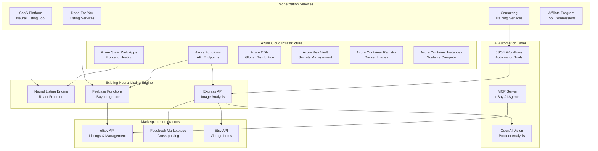
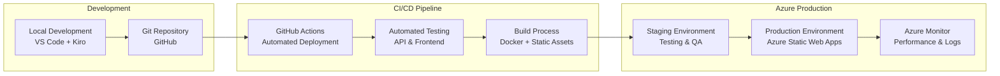

# Design Document

## Overview

This design outlines the deployment and monetization strategy for Hidden Haven Threads vintage reselling shop, leveraging Azure credits and free tools while integrating the existing Neural Listing Engine with multi-marketplace capabilities (eBay, Facebook Marketplace, Etsy) and advanced AI automation workflows.

The solution builds upon the existing codebase with OpenAI Vision analysis, eBay API integration, and Firebase functions, while adding Azure deployment infrastructure and multiple revenue streams through SaaS offerings and automation services.

## Architecture

### High-Level System Architecture



### Deployment Architecture



## Components and Interfaces

### 1. Frontend Enhancement (React + Azure Static Web Apps)

**Hidden Haven Threads Website Components:**
- **Product Showcase**: Display vintage items with AI-generated descriptions
- **Neural Listing Tool**: SaaS interface for other resellers
- **Marketplace Dashboard**: Multi-platform listing management
- **Revenue Analytics**: Track sales across all channels
- **Subscription Management**: Handle SaaS billing and features

**Key Interfaces:**
```typescript
interface ProductAnalysis {
  seoTitle: string;
  brand: string;
  productType: string;
  size: string;
  color: { primary: string; secondary: string };
  condition: string;
  keyFeatures: string;
  estimatedYear: number;
  countryOfManufacture: string;
  material: string;
  fabricType: string;
  theme: string;
  suggestedPrice: number;
  confidence: number;
  categoryId?: string;
  categoryName?: string;
}

interface MarketplaceListing {
  sku: string;
  title: string;
  description: string;
  price: number;
  imageUrls: string[];
  marketplace: 'ebay' | 'facebook' | 'etsy';
  status: 'draft' | 'active' | 'sold' | 'ended';
}

interface SaaSSubscription {
  userId: string;
  plan: 'basic' | 'pro' | 'enterprise';
  features: string[];
  monthlyListingLimit: number;
  aiAnalysisLimit: number;
  marketplaceCount: number;
}
```

### 2. Enhanced API Layer (Azure Functions + Express)

**Extended API Endpoints:**
- `/api/analyze-images` - Existing OpenAI Vision analysis
- `/api/marketplace/facebook` - Facebook Marketplace integration
- `/api/marketplace/etsy` - Etsy API integration
- `/api/automation/workflows` - JSON workflow execution
- `/api/saas/subscriptions` - SaaS billing management
- `/api/mcp/ebay-agents` - MCP server eBay operations
- `/api/insights/competitor` - Competitive analysis
- `/api/content/seo` - SEO content generation

**MCP Server Integration:**
```javascript
// MCP Server for eBay AI Agents
class EBayMCPServer {
  constructor() {
    this.operations = [
      'createListingDraft',
      'manageSellerAccount',
      'searchProductData',
      'retrieveMetadata',
      'bulkOperations'
    ];
  }
  
  async executeOperation(operation, params) {
    // Integrate with existing eBay API functions
    // Leverage 36 eBay seller account management operations
    // Use AI agents for automated decision making
  }
}
```

### 3. Multi-Marketplace Integration

**Facebook Marketplace API Integration:**
```javascript
class FacebookMarketplaceAPI {
  async createListing(productData) {
    // Transform Neural Listing Engine data for Facebook
    const fbListing = {
      name: productData.seoTitle,
      description: this.generateFacebookDescription(productData),
      price: productData.suggestedPrice,
      category: this.mapToFacebookCategory(productData.categoryName),
      images: productData.imageUrls,
      location: process.env.SELLER_LOCATION
    };
    
    return await this.postToFacebook(fbListing);
  }
}
```

**Etsy API Integration:**
```javascript
class EtsyAPI {
  async createVintageListing(productData) {
    // Leverage vintage-specific analysis from Neural Listing Engine
    const etsyListing = {
      title: productData.seoTitle,
      description: this.generateVintageDescription(productData),
      price: productData.suggestedPrice,
      tags: this.generateVintageTags(productData),
      is_vintage: productData.estimatedYear < 2000,
      vintage_year: productData.estimatedYear,
      materials: [productData.material, productData.fabricType],
      style: [productData.theme]
    };
    
    return await this.postToEtsy(etsyListing);
  }
}
```

### 4. AI Automation Workflow Integration

**JSON Workflow Execution Engine:**
```javascript
class WorkflowEngine {
  constructor() {
    this.workflows = {
      'product-research-seo': this.loadWorkflow('AI-Powered_Product_Research_SEO_Content_Automation'),
      'competitor-monitoring': this.loadWorkflow('Competitor_Price_Monitoring_with_Web_Scraping'),
      'content-generation': this.loadWorkflow('Generate_SEO_optimized_blog_content'),
      'market-intelligence': this.loadWorkflow('Intelligent_Web_Query_and_Semantic_Re-Ranking'),
      'product-hunt-tracking': this.loadWorkflow('Track_Daily_Product_Hunt_Launches'),
      'business-leads': this.loadWorkflow('Discover_Business_Leads_with_Gemini_Brave_Search')
    };
  }
  
  async executeWorkflow(workflowName, inputData) {
    const workflow = this.workflows[workflowName];
    return await this.processWorkflowSteps(workflow, inputData);
  }
}
```

## Data Models

### Product Data Model (Enhanced)
```sql
-- Azure Cosmos DB / PostgreSQL Schema
CREATE TABLE products (
  id UUID PRIMARY KEY,
  sku VARCHAR(50) UNIQUE NOT NULL,
  
  -- AI Analysis Results
  seo_title VARCHAR(200),
  brand VARCHAR(100),
  product_type VARCHAR(100),
  size VARCHAR(50),
  primary_color VARCHAR(50),
  secondary_color VARCHAR(50),
  condition VARCHAR(50),
  key_features TEXT,
  estimated_year INTEGER,
  country_of_manufacture VARCHAR(100),
  material VARCHAR(100),
  fabric_type VARCHAR(100),
  theme VARCHAR(100),
  suggested_price DECIMAL(10,2),
  confidence_score DECIMAL(3,2),
  
  -- Marketplace Data
  ebay_category_id VARCHAR(20),
  ebay_category_name VARCHAR(200),
  facebook_category VARCHAR(100),
  etsy_category VARCHAR(100),
  
  -- Images and Media
  image_urls TEXT[], -- Array of image URLs
  ebay_eps_urls TEXT[], -- eBay EPS hosted images
  
  -- Listing Status
  ebay_listing_id VARCHAR(50),
  facebook_listing_id VARCHAR(50),
  etsy_listing_id VARCHAR(50),
  
  -- Metadata
  created_at TIMESTAMP DEFAULT NOW(),
  updated_at TIMESTAMP DEFAULT NOW(),
  user_id UUID REFERENCES users(id)
);

CREATE TABLE marketplace_listings (
  id UUID PRIMARY KEY,
  product_id UUID REFERENCES products(id),
  marketplace VARCHAR(20) NOT NULL, -- 'ebay', 'facebook', 'etsy'
  listing_id VARCHAR(100),
  status VARCHAR(20), -- 'draft', 'active', 'sold', 'ended'
  price DECIMAL(10,2),
  views INTEGER DEFAULT 0,
  watchers INTEGER DEFAULT 0,
  created_at TIMESTAMP DEFAULT NOW(),
  ended_at TIMESTAMP
);
```

### SaaS Subscription Model
```sql
CREATE TABLE saas_subscriptions (
  id UUID PRIMARY KEY,
  user_id UUID REFERENCES users(id),
  plan VARCHAR(20) NOT NULL, -- 'basic', 'pro', 'enterprise'
  status VARCHAR(20) DEFAULT 'active', -- 'active', 'cancelled', 'past_due'
  
  -- Feature Limits
  monthly_listing_limit INTEGER,
  ai_analysis_limit INTEGER,
  marketplace_count INTEGER,
  bulk_upload_enabled BOOLEAN DEFAULT FALSE,
  advanced_analytics_enabled BOOLEAN DEFAULT FALSE,
  
  -- Billing
  monthly_price DECIMAL(8,2),
  billing_cycle_start DATE,
  billing_cycle_end DATE,
  stripe_subscription_id VARCHAR(100),
  
  created_at TIMESTAMP DEFAULT NOW(),
  updated_at TIMESTAMP DEFAULT NOW()
);

CREATE TABLE usage_tracking (
  id UUID PRIMARY KEY,
  user_id UUID REFERENCES users(id),
  subscription_id UUID REFERENCES saas_subscriptions(id),
  
  -- Usage Counters
  listings_created INTEGER DEFAULT 0,
  ai_analyses_used INTEGER DEFAULT 0,
  api_calls_made INTEGER DEFAULT 0,
  
  -- Period
  period_start DATE,
  period_end DATE,
  
  created_at TIMESTAMP DEFAULT NOW()
);
```

## Error Handling

### Marketplace API Error Handling
```javascript
class MarketplaceErrorHandler {
  async handleEBayError(error, operation, retryCount = 0) {
    const maxRetries = 3;
    
    if (error.response?.status === 429) { // Rate limit
      const delay = Math.pow(2, retryCount) * 1000; // Exponential backoff
      await this.sleep(delay);
      if (retryCount < maxRetries) {
        return await this.retryOperation(operation, retryCount + 1);
      }
    }
    
    if (error.response?.status === 401) { // Token expired
      await this.refreshEBayToken();
      return await this.retryOperation(operation, 0);
    }
    
    // Log error and notify admin
    await this.logError('eBay API Error', error, operation);
    throw new MarketplaceError(`eBay operation failed: ${error.message}`);
  }
  
  async handleFacebookError(error, operation) {
    // Similar error handling for Facebook Marketplace
    if (error.code === 'MARKETPLACE_LISTING_LIMIT_REACHED') {
      throw new MarketplaceError('Facebook listing limit reached for today');
    }
    
    await this.logError('Facebook API Error', error, operation);
    throw new MarketplaceError(`Facebook operation failed: ${error.message}`);
  }
}
```

### SaaS Billing Error Handling
```javascript
class BillingErrorHandler {
  async handleStripeWebhook(event) {
    try {
      switch (event.type) {
        case 'invoice.payment_failed':
          await this.handlePaymentFailure(event.data.object);
          break;
        case 'customer.subscription.deleted':
          await this.handleSubscriptionCancellation(event.data.object);
          break;
        case 'invoice.payment_succeeded':
          await this.handleSuccessfulPayment(event.data.object);
          break;
      }
    } catch (error) {
      await this.logError('Stripe Webhook Error', error, event);
      throw error;
    }
  }
}
```

## Testing Strategy

### 1. Unit Testing
- **API Endpoints**: Test all marketplace integrations
- **AI Analysis**: Validate OpenAI Vision responses
- **Workflow Engine**: Test JSON workflow execution
- **SaaS Features**: Test subscription management and billing

### 2. Integration Testing
- **Multi-Marketplace Flow**: End-to-end listing creation
- **MCP Server Operations**: Test all 36 eBay operations
- **Payment Processing**: Stripe integration testing
- **Azure Services**: Function apps and static web apps

### 3. Performance Testing
- **Bulk Upload**: Test with 100+ simultaneous listings
- **Image Processing**: Large image batch analysis
- **API Rate Limits**: Marketplace API throttling
- **Azure Scaling**: Auto-scaling under load

### 4. User Acceptance Testing
- **SaaS Onboarding**: New user subscription flow
- **Listing Creation**: Multi-marketplace posting
- **Revenue Analytics**: Dashboard accuracy
- **Mobile Experience**: Responsive design testing

## Deployment Strategy

### Phase 1: Azure Infrastructure Setup (Week 1)
1. **Azure Static Web Apps**: Deploy React frontend
2. **Azure Functions**: Migrate existing API endpoints
3. **Azure Key Vault**: Secure API key management
4. **Azure CDN**: Global content delivery setup
5. **GitHub Actions**: CI/CD pipeline configuration

### Phase 2: Multi-Marketplace Integration (Week 2-3)
1. **Facebook Marketplace API**: Integration and testing
2. **Etsy API**: Vintage-specific listing features
3. **MCP Server**: eBay AI agent deployment
4. **Workflow Engine**: JSON automation tool integration
5. **Error Handling**: Robust marketplace error management

### Phase 3: SaaS Platform Launch (Week 4-5)
1. **Subscription Management**: Stripe integration
2. **Feature Gating**: Plan-based access control
3. **Usage Tracking**: API call and listing limits
4. **Admin Dashboard**: User and subscription management
5. **Documentation**: API docs and user guides

### Phase 4: Advanced Features (Week 6-8)
1. **Advanced Analytics**: Revenue and performance dashboards
2. **Competitive Intelligence**: Automated market research
3. **Content Generation**: SEO blog and FAQ automation
4. **Affiliate Program**: Commission tracking system
5. **Mobile App**: React Native companion app

This design provides a comprehensive roadmap for deploying Hidden Haven Threads with full multi-marketplace integration, leveraging all existing tools and creating multiple revenue streams through SaaS offerings and automation services.